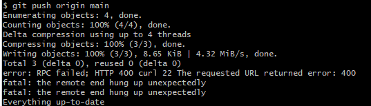

# Github常见异常以及解决办法

### 1.error: RPC failed; HTTP 400 curl 22 The requested URL returned error: 400

error: RPC failed; HTTP 400 curl 22 The requested URL returned error: 400
fatal: the remote end hung up unexpectedly
fatal: the remote end hung up unexpectedly

，

将文件推送到远程仓库，提示`RPC failed; HTTP 400 curl 22 The requested URL returned error: 400`，有以下几种可能：

1.如果文件很大，则可能是因为Git缓冲区溢出，可以尝试增加缓冲区大小，或者分批推送。设置缓冲区大小的命令为：`git config --golbal http.postBuffer <size-in-bytes>`，其中<size -in-bytes>可以替换为更大的值。

2.如果文件不大，但是也出现了该问题，可能是网络问题，多推送几次试一试。